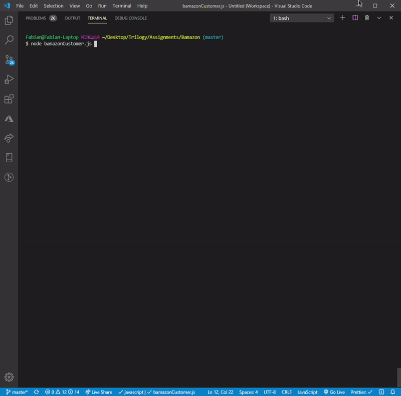

# Bamazon
Amazon-like storefront using MySQL and Node.js.

Trilogy Education Services Full-Stack Web Developer Program

Week 12 Homework Assignment: Node.js & MySQL

Create an Amazon-like storefront using MySQL and Node.js.

## Overview

Amazon-like storefront using MySQL and Node.js. The app takes in orders from customers and depletes stock from the store's inventory.  This application uses the MySQL and Inquirer npm packages.

## Instructions

### Customer View

1. From your Terminal, run the Node application called `bamazonCustomer.js`. Running this application will first display all of the items available for sale. Including the products' ids, names, and prices.

2. The app prompts the users with two messages:

    * The first asks them the ID of the product they would like to buy.
    * The second message asks how many units of the product they would like to buy.

3. Once the customer has placed the order, the app checks if the store has enough of the product to meet the customer's request.

    * If not, the app cancells the order due to  `Insufficient quantity!`, and then prevents the order from going through.

4. However, if the store _does_ have enough of the product, the app fulfills the customer's order.
    * It updates the SQL database to reflect the remaining quantity.
    * Once the update goes through, it shows the customer the information, including the total cost of their purchase.
    
5. Finally the app prompts the user again to see if they wish to continue shopping or if they are done.

#### Screenshots & Video of Working App for Customer View

1. Here is what the working app looks like, with list of available items:

2. After user inputs desired item id number and amount, will update the available stock and alert user that their order was processed:

3. If customer's item is out of stock, or order quantity is too large, will alert user that their order was cancelled:

4. Here is a quick video of the working app:

### Manager View

1. From your Terminal, run the Node application called `bamazonManager.js`. Running this application will:

* List a set of menu options:

* View Products for Sale

* View Low Inventory

* Add to Inventory

* Add New Product

* If a manager selects `View Products for Sale`, the app lists every available item: the item IDs, names, prices, and quantities.

* If a manager selects `View Low Inventory`, then it lists all items with an inventory count lower than five.

* If a manager selects `Add to Inventory`, app displays a prompt that will let the manager "add more" of any item currently in the store.

* If a manager selects `Add New Product`, app allows the manager to add a completely new product to the store.

#### Screenshots & Video of Working App for Manager View

1. The app has four different "Manager Options" to choose from, here the user selected the "View Products for Sale" option:

2. Next, the "View Low Inventory" option is chosen to see which items in our inventory are below 5 in stock. We can see that one item is below 5. The user then uses the "Add to Inventory" option to select the low item and add 3 of it to the stock. User is then prompted their addition was successful:
 

3. Lastly, the final option of "Add New Product" is selected to add a new item to the table of available items. User is prompted to enter the item name, category, price per unit, and number of units. Here the user added a Wireless Headset under the category "Electronics" and is alerted of the successful addition:

4. Here is a quick video of the working app, click picture below:

### Additional Screenshots of the Initial Database Creation

1. Here is a screenshot of MySQLWorkbench and the process for initially creating the database:

2. Here is a screenshot of MySQLWorkbench after an item has been added to the table:

## Copyright

Fabian Ramirez (C) 2020. All Rights Reserved.